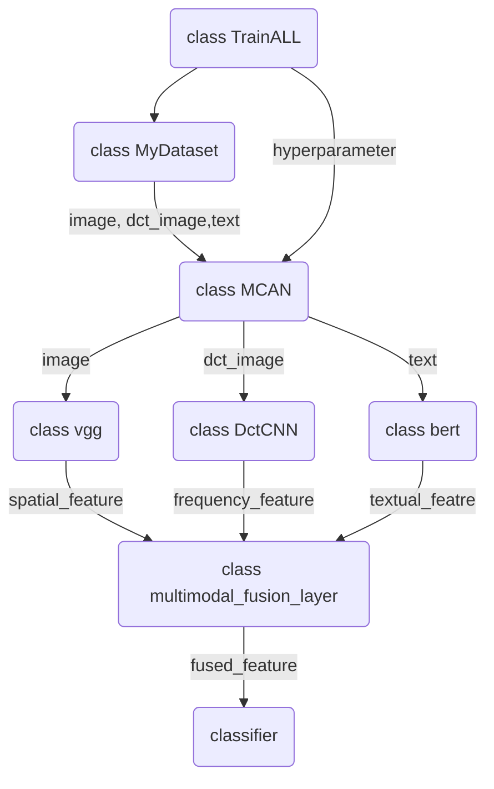

# 2021290227(多模态融合虚假新闻检测)
这是一篇来自ACL2021的文章，原文链接如下：

[Multimodal Fusion with Co-Attention Networks for Fake news Detection](https://aclanthology.org/2021.findings-acl.226.pdf)

官方代码地址： [GitHub-wuyang45/MCAN_code](https://github.com/wuyang45/MCAN_code)

本项目是对原文MCAN思路的复现，但使用了[GossipCop数据集](https://github.com/junyachen/Data-examples#integration-based-legitimate)，旨在对原文MCAN模型进行测试并验证其在更广泛的数据集上的适用性。

# Main idea
社交媒体上多模态假新闻检测的独特挑战之一是如何融合多模态特征。人们在阅读图像新闻时，往往先观察图像，然后再阅读文字。这个过程可能会重复多次，不断融合图像和文本信息。受此启发，MCAN旨在学习所有模式之间的相互依赖性，以有效地融合它们，从而提高假新闻检测的性能

# Architecture
首先，我们提取图像的语义级和物理级特征以及文本特征。然后我们使用深度共同注意网络将它们融合在一起，该网络由多个共同注意层组成。最后利用多模态融合表示来判断输入新闻的真实性

# Create the env
首先创建代码所需的环境，推荐使用anaconda创建虚拟环境。代码运行所需要的关键包已在requirements.txt中列出。

The python version is python-3.8.16. The detailed version of some packages is available in requirements.txt. You can install all the required packages using the following command:
```
conda install --yes --file requirements.txt
```

# Data
数据集可以从[GossipCop数据集](https://github.com/junyachen/Data-examples#integration-based-legitimate)中获取，本模型同时我们使用了图片信息以及文本信息，将下载后的json文件重新命名，以满足后面数据预处理的读取。命名规则为`gossipcop_v3-X.json`，X为1~6。

## Process dataset
运行下面的代码处理原始数据，得到满足MCAN输入格式的文件：
```
python data_process.py
```
上述代码运行完成之后，会在当前目录下的processd_data中生成每个数据集的train.txt和test.txt文件。

# Download pre_trained models
运行代码需要预训练好的 bert-base-chinese, bert-base-multilingual-cased 以及 pytorch的[vgg19](https://download.pytorch.org/models/vgg19-dcbb9e9d.pth) 模型。

下载之后将模型放入当前目录下的models文件夹中。

# Structure of MCAN_reproduction
主要的训练代码可以在`MCAN_reproduction.py`中查看

The main logic of the code is as follows:



# Run
直接运行py文件即可开始训练：
```
python MCAN_reproduction.py
```

# References
If you are insterested in this work, and want to use the dataset or codes in this repository, please star this repository and cite by:

```
@inproceedings{wu2021multimodal,
        title={Multimodal fusion with co-attention networks for fake news detection},
        author={Wu, Yang and Zhan, Pengwei and Zhang, Yunjian and Wang, Liming and Xu, Zhen},
        booktitle={Findings of the Association for Computational Linguistics: ACL-IJCNLP 2021},
        pages={2560--2569},
        year={2021}
}
```

